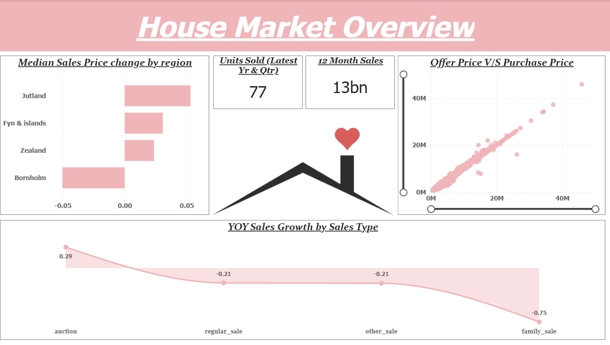
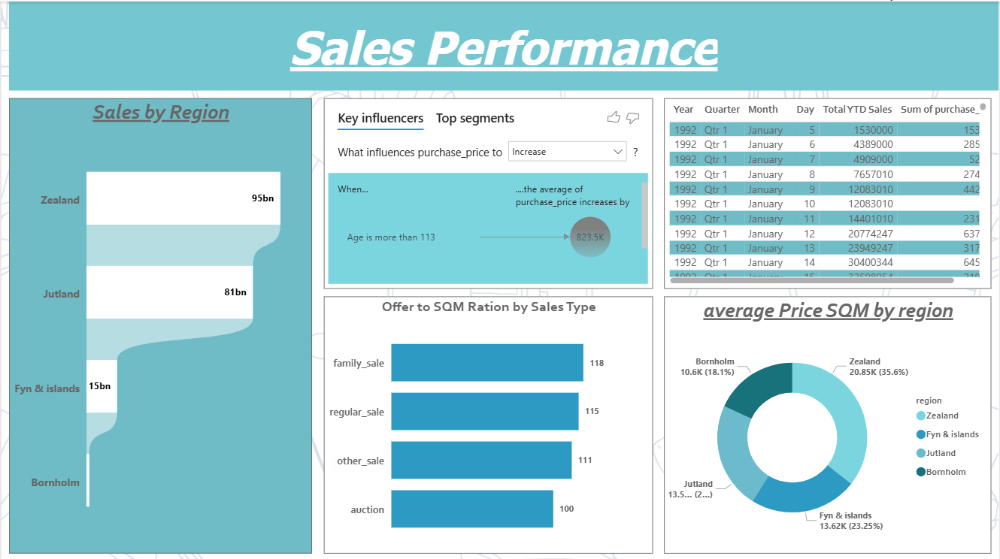
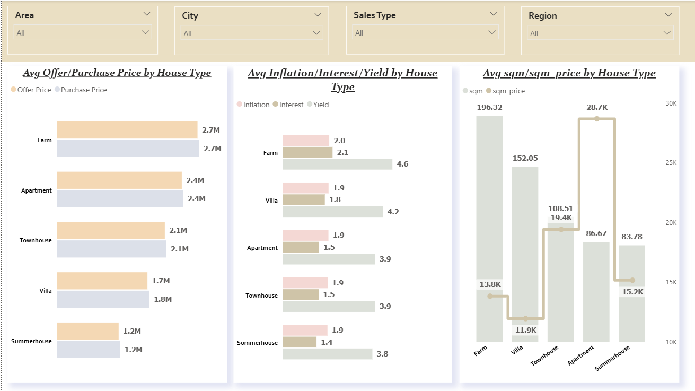

# 🏠 Housing Market Analysis – Sales, Pricing & Market Trends Dashboard

An interactive Power BI dashboard designed to analyze housing market performance, property pricing behavior, and regional sales patterns. This project helps identify key real estate trends, evaluate market growth, and support data-driven decisions for investors, buyers, and policy planners.

---

## 🎯 Project Objective
To explore and compare housing prices, sales distribution, YOY growth, and market indicators across regions and property types.  
The goal is to uncover insights that highlight market opportunities, pricing anomalies, and overall real estate performance trends.

---

## 📸 Dashboard Preview

---

## 🛠️ Tech Stack
- **Power BI** – Dashboard development  
- **Power Query** – Data cleaning & transformation  
- **Excel / CSV** – Source dataset  

---

## 📂 Dataset Used
🔗 [Housing Dataset](data/HousingData.xlsx)

---

## ❓ Key Questions (KPIs)
- Which regions contribute the highest total sales?  
- How have median sales prices changed across regions?  
- What is the relationship between offer price and purchase price?  
- How does YOY sales growth vary across different sales types?  
- Which house types show the highest inflation, interest, and yield values?  
- How do sqm and sqm_price vary across property categories?

---

## ⭐ Features
- Clean & visually appealing multi-page dashboard  
- Sales and pricing analysis by region, house type & sales type  
- Offer vs. purchase price comparison charts  
- YOY sales growth visualization  
- Detailed market indicators: inflation, interest, yield, sqm pricing  
- Interactive filters for area, city, region, and sales type  

---

## 🔗 Dashboard File
Download the full Power BI project:  
📁 [Housing_Project.pbix](dashboard/Housing_Project.pbix)

---

## 🔄 Process / Workflow
- Cleaned and standardized the dataset using Power Query  
- Built model relationships across multiple tables  
- Designed visuals to highlight regional and property-level trends  
- Created KPI cards and comparison visuals for better clarity  
- Organized insights across multiple pages for easy navigation  

---

## 🔍 Project Insights
- **Zealand** and **Jutland** lead in total sales volume.  
- Offer and purchase price trends are strongly correlated across all house types.  
- **Family_sale** and **regular_sale** categories show strong SQM ratios.  
- YOY growth varies significantly, with some sales types showing decline.  
- High-value properties like **Farm** and **Villa** show the highest yield and sqm_price values.  

---

## 🧾 Final Conclusion
This dashboard provides a clear and comprehensive view of the housing market - highlighting pricing behavior, sales patterns, and property performance. It enables stakeholders to make informed decisions, identify investment opportunities, and understand emerging real estate trends.

---
